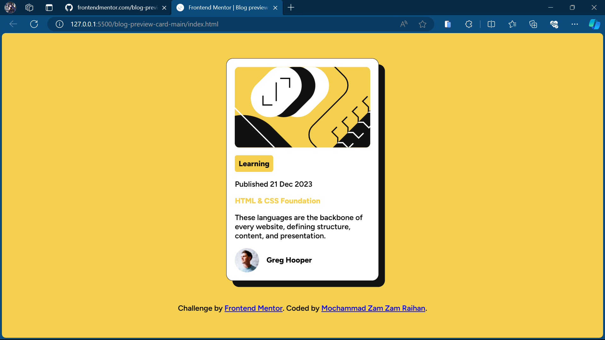

# Frontend Mentor - Blog preview card solution

This is a solution to the [Blog preview card challenge on Frontend Mentor](https://www.frontendmentor.io/challenges/blog-preview-card-ckPaj01IcS). Frontend Mentor challenges help you improve your coding skills by building realistic projects.

## Table of contents

- [Overview](#overview)
  - [The challenge](#the-challenge)
  - [Screenshot](#screenshot)
  - [Links](#links)
- [My process](#my-process)
  - [Built with](#built-with)
  - [What I learned](#what-i-learned)
  - [Continued development](#continued-development)
  - [Useful resources](#useful-resources)
- [Author](#author)
- [Acknowledgments](#acknowledgments)

**Note: Delete this note and update the table of contents based on what sections you keep.**

## Overview

### The challenge

Users should be able to:

- See hover and focus states for all interactive elements on the page

### Screenshot

This is the screenshot of my solution.

**Note: Delete this note and the paragraphs above when you add your screenshot. If you prefer not to add a screenshot, feel free to remove this entire section.**

## My process

### Built with

- HTML
- CSS
- Flexbox
- Desktop-First workflow

**Note: These are just examples. Delete this note and replace the list above with your own choices**

### What I learned

At the start on doing this project, I don't know how to setup the black shadow behind the card. I knew it was box-shaodow property but I didn't know how to do it. Thanks to [mdn web docs.](https://developer.mozilla.org/en-US/docs/Web/CSS/box-shadow) now I know how to set the box shadow and adjust the value according to the design example.

**Note: Delete this note and the content within this section and replace with your own learnings.**

**Note: Delete this note and replace the list above with resources that helped you during the challenge. These could come in handy for anyone viewing your solution or for yourself when you look back on this project in the future.**

## Author

- Website - [Mochammad Zam Zam Raihan](zamzamraihan.github.io)
